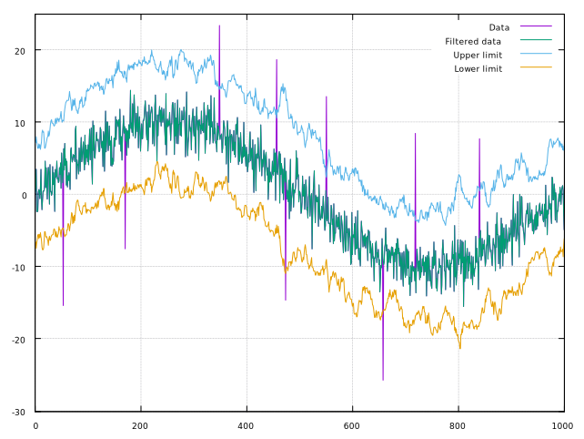

[](https://github.com/frithnanth/raku-Math-Libgsl-DigitalFiltering/actions) [](https://travis-ci.org/frithnanth/raku-Math-Libgsl-DigitalFiltering)



NAME
====

Math::Libgsl::DigitalFiltering - An interface to libgsl, the Gnu Scientific Library - Digital Filtering

SYNOPSIS
========

```raku
use Math::Libgsl::Vector;
use Math::Libgsl::DigitalFiltering;

my constant $N = 1000;
my constant $K = 21;
my Math::Libgsl::Vector $x .= new: :size($N);
$x.scanf('data.dat');
my Math::Libgsl::DigitalFiltering::Gaussian $gauss .= new: :size($K);
my $y = $gauss.filter(2.5, $x);
```

DESCRIPTION
===========

Math::Libgsl::DigitalFiltering is an interface to the Digital Filtering functions of libgsl, the Gnu Scientific Library.

This module exports four classes:

  * Math::Libgsl::DigitalFiltering::Gaussian

  * Math::Libgsl::DigitalFiltering::Median

  * Math::Libgsl::DigitalFiltering::RMedian

  * Math::Libgsl::DigitalFiltering::Impulse

each encapsulates the methods and the buffers needed to create and use the filter on the data stored in a Math::Libgsl::Vector object.

Math::Libgsl::DigitalFiltering::Gaussian
----------------------------------------

This class encapsulate a Gaussian filter.

### multi method new(Int $size!)

### multi method new(Int :$size!)

The constructor accepts one simple or named argument: the kernel size.

### filter(Num() $alpha!, Math::Libgsl::Vector $x!, Int :$order = 0, Int :$endtype = GSL_MOVSTAT_END_PADZERO, Bool :$inplace? --> Math::Libgsl::Vector)

This method applies a Gaussian filter parameterized by **$alpha** to the input vector **$x**. The optional named argument **:$order** specifies the derivative order, with `0` corresponding to a Gaussian, `1` corresponding to a first derivative Gaussian, and so on. The optional named argument **:$endtype** specifies how the signal end points are handled. The symbolic names for this argument are listed in the Math::Libgsl::Constants module as follows:

  * **GSL_MOVSTAT_END_PADZERO**: inserts zeros into the window near the signal end points

  * **GSL_MOVSTAT_END_PADVALUE**: pads the window with the first and last sample in the input signal

  * **GSL_MOVSTAT_END_TRUNCATE**: no padding is performed: the windows are truncated as the end points are approached

The boolean named argument **:$inplace** directs the method to apply the filter in-place. This method returns the filter output as a **Math::Libgsl::Vector** object.

### kernel(Num() $alpha!, Int $size, Int :$order = 0, Int :$normalize = 0 --> Math::Libgsl::Vector)

This method constructs a Gaussian kernel parameterized by **$alpha**, of size **$size**. The optional named argument **:$order** specifies the derivative order. The optional named argument **:$normalize** specifies if the kernel is to be normalized to sum to one on output. This method returns the filter output as a **Math::Libgsl::Vector** object.

Math::Libgsl::DigitalFiltering::Median
--------------------------------------

This class encapsulate a Median filter.

### multi method new(Int $size!)

### multi method new(Int :$size!)

The constructor accepts one simple or named argument: the kernel size.

### filter(Math::Libgsl::Vector $x!, Int :$endtype = GSL_MOVSTAT_END_PADZERO, Bool :$inplace? --> Math::Libgsl::Vector)

This method applies a Median filter to the input vector **$x**. The optional named argument **:$endtype** specifies how the signal end points are handled. The optional boolean named argument **:$inplace** directs the method to apply the filter in-place. This method returns the filter output as a **Math::Libgsl::Vector** object.

Math::Libgsl::DigitalFiltering::RMedian
---------------------------------------

This class encapsulate a recursive Median filter.

### multi method new(Int $size!)

### multi method new(Int :$size!)

The constructor accepts one simple or named argument: the kernel size.

### filter(Math::Libgsl::Vector $x!, Int :$endtype = GSL_MOVSTAT_END_PADZERO, Bool :$inplace? --> Math::Libgsl::Vector)

This method applies a Median filter to the input vector **$x**. The optional named argument **:$endtype** specifies how the signal end points are handled. The optional boolean named argument **:$inplace** directs the method to apply the filter in-place. This method returns the filter output as a **Math::Libgsl::Vector** object.

Math::Libgsl::DigitalFiltering::Impulse
---------------------------------------

This class encapsulate an Impulse detection filter.

### multi method new(Int $size!)

### multi method new(Int :$size!)

The constructor accepts one simple or named argument: the kernel size.

### filter(Math::Libgsl::Vector $x!, Num() $tuning, Int :$endtype = GSL_MOVSTAT_END_PADZERO, Int :$scaletype = GSL_FILTER_SCALE_MAD, Bool :$inplace? --> List)

This method applies an Impulse filter to the input vector **$x**, using the tuning parameter **$tuning**. The optional named argument **:$endtype** specifies how the signal end points are handled. The optional named argument **:$scaletype** specifies how the scale estimate Sₙ of the window is calculated. The symbolic names for this argument are listed in the Math::Libgsl::Constants module as follows:

  * **GSL_FILTER_SCALE_MAD**: specifies the median absolute deviation (MAD) scale estimate

  * **GSL_FILTER_SCALE_IQR**: specifies the interquartile range (IQR) scale estimate

  * **GSL_FILTER_SCALE_SN**: specifies the so-called Sₙ statistic

  * **GSL_FILTER_SCALE_QN**: specifies the so-called Qₙ statistic

The optional boolean named argument **:$inplace** directs the method to apply the filter in-place. This method returns a List of values:

  * the window medians, as a **Math::Libgsl::Vector** object

  * the window Sₙ, as a **Math::Libgsl::Vector** object

  * the number of outliers as an Int

  * the location of the outliers as a **Math::Libgsl::Vector::Int32** object

C Library Documentation
=======================

For more details on libgsl see [https://www.gnu.org/software/gsl/](https://www.gnu.org/software/gsl/). The excellent C Library manual is available here [https://www.gnu.org/software/gsl/doc/html/index.html](https://www.gnu.org/software/gsl/doc/html/index.html), or here [https://www.gnu.org/software/gsl/doc/latex/gsl-ref.pdf](https://www.gnu.org/software/gsl/doc/latex/gsl-ref.pdf) in PDF format.

Prerequisites
=============

This module requires the libgsl library to be installed. Please follow the instructions below based on your platform:

Debian Linux and Ubuntu 20.04
-----------------------------

    sudo apt install libgsl23 libgsl-dev libgslcblas0

That command will install libgslcblas0 as well, since it's used by the GSL.

Ubuntu 18.04
------------

libgsl23 and libgslcblas0 have a missing symbol on Ubuntu 18.04. I solved the issue installing the Debian Buster version of those three libraries:

  * [http://http.us.debian.org/debian/pool/main/g/gsl/libgslcblas0_2.5+dfsg-6_amd64.deb](http://http.us.debian.org/debian/pool/main/g/gsl/libgslcblas0_2.5+dfsg-6_amd64.deb)

  * [http://http.us.debian.org/debian/pool/main/g/gsl/libgsl23_2.5+dfsg-6_amd64.deb](http://http.us.debian.org/debian/pool/main/g/gsl/libgsl23_2.5+dfsg-6_amd64.deb)

  * [http://http.us.debian.org/debian/pool/main/g/gsl/libgsl-dev_2.5+dfsg-6_amd64.deb](http://http.us.debian.org/debian/pool/main/g/gsl/libgsl-dev_2.5+dfsg-6_amd64.deb)

Installation
============

To install it using zef (a module management tool):

    $ zef install Math::Libgsl::DigitalFiltering

AUTHOR
======

Fernando Santagata <nando.santagata@gmail.com>

COPYRIGHT AND LICENSE
=====================

Copyright 2020 Fernando Santagata

This library is free software; you can redistribute it and/or modify it under the Artistic License 2.0.

